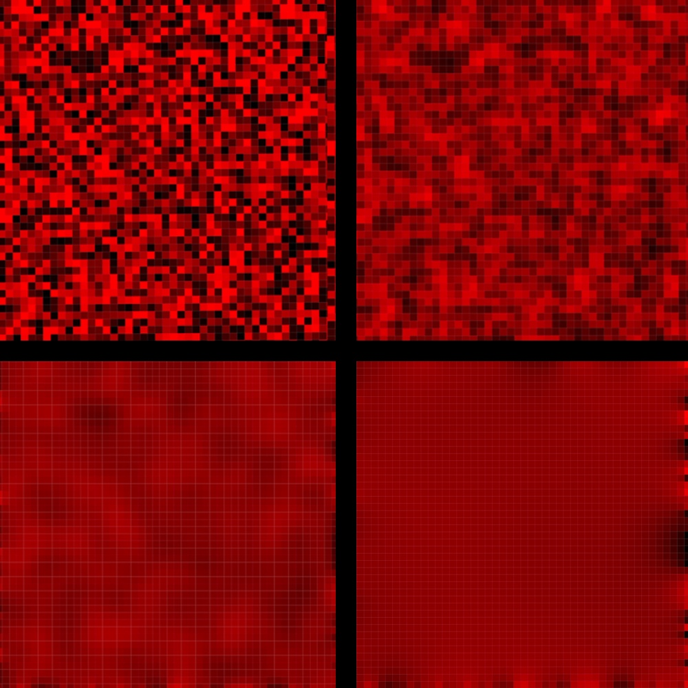

# CellGrid

The CellGrid package provides a type for representing and rendering
a rectangular grid of cells.  The grid can be rendered as
HTML, SVG, WebGL, or Image.  In the HTML and SVG versions, the grid responds to
mouse clicks.  Here an example of how one sets up a `CellGrid Int`.

```elm
    import Array

    grid1 : CellGrid Int
    grid1 = CellGrid.initialize (Dimensions 2 2) (\i j -> i)

    toLists grid1
    --> [ [0,0]
    --> , [1,1]
    --> ]
```

One can define `CellGrid a`, where `a` is any type.

There are two on-line demo applications: [Conway's game of life](https://jxxcarlson.github.io/app/gameoflife2.html), and [a simulation
of heat conduction](https://jxxcarlson.github.io/app/heat-model.html).  See the `examples` folder on [GitHub](https://github.com/jxxcarlson/elm-cell-grid)
for the code. In the first example, we use the type

```elm
    CellGrid State,
```
where

```elm
    type State = Occupied | Unoccupied
```

In the second, we use

```elm
    CellGrid Float
```
In this case, the contents of a cell represents
its temperature, which is normalized to lie in the 
interval [0,1]. One can create a CellGrid, transform it, and render it in 
the formats mentioned above.  Note the type

```elm
    type alias Msg =
        { cell : Position
        , coordinates :
            { x : Float
            , y : Float
            }
        }
```

It is referenced by the function which renders a cell
so that when the user clicks on a cell, a message
is sent containing its *Position i j* as well as its local floating
point coordinates *x* and *y*.  Consult `./examples/GameOfLife.elm`,
to see how this message is used to respond to user clicks.





## Rendering a CellGrid (Html and SVG)

Render a `CellGrid` using the function

```elm
    CellGrid.Render.asHtml : { width : Int, height : Int }
        -> CellStyle a -> CellGrid a -> Html Msg
```

The CellStyle argument determines how a cell is rendered:

```elm
    type alias CellStyle a =
        { cellWidth : Float
        , cellHeight : Float
        , toColor : a -> Color
        , gridLineWidth : Float
        , gridLineColor : Color
        }
```

Here is an example:

```elm
    cellStyle : CellStyle Float
    cellStyle =
        { toColor = \z -> Color.rgb z 0 0
        ,  ellWidth = 10
         , cellHeight = 10
         , gridLineColor = Color.rgb 180 0 0
         , gridLineWidth = 0.5
        }
```

where `Color` is from the package `avh4/elm-color`. This is the 
`cellStyle` value used in Conway's Game of Life.


## Rendering as WebGL

Please consult `./examples/HeatMap/Image2.elm`.
One uses the following from `CellGrid.RenderWebGL``

```elm
asHtml : { width : Int, height : Int } 
          -> (a -> Color) -> CellGrid a -> Html.Html msg
```

where the second parameter is a function `a -> Color` like
the following

```elm
    colorMap : Float -> Color.Color
    colorMap t =
        Color.rgb t 0 0
```

## Rendering as an Image

Please consult `./examples/HeatMap/Image3.elm`.
One uses the following from `CellGrid.Image`

```elm
    toImage : CellGrid Color -> Image
```

Note that one can map a `CellGrid a` to a `CellGrid Color`, e.g., using

```elm
    colorMap : Float -> Color.Color
    colorMap t =
        Color.rgb t 0 0

   cgImage = CellGrid.Image.asBmpUri (CellGrid.map colorMap cgFloat)

```

The `Image` type is defined in the package `justgook/elm-image`.

## Credits

Many thanks to Folkert de Vries for code optimizations and API improvements, 
including the new `CellGrid.Image` module which
gives the fastest of the rendering options.